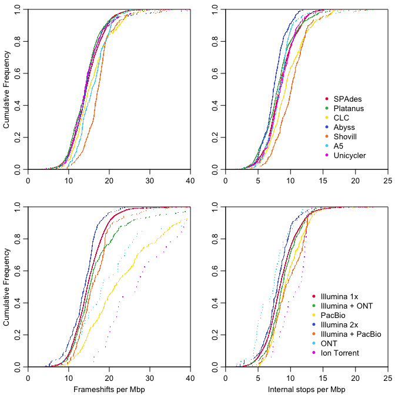

<center>
**Plots and scripts for:**
</center>
<center>
Many purported pseudogenes in bacterial genomes are bonafide genes
</center>
================
Nicholas P. Cooley, Department of Biomedical Informatics, University of
PittsburghErik S. Wright, Department of Biomedical Informatics,
University of Pittsburgh
2023-09-15

# Pseudogenes!

This github repo contains data and scripts necessary to recreate the
plots present in the manuscript in progress **Many purported pseudogenes
in bacterial genomes are bonafide genes**. The data present in this repo
are mostly lightweight summary tables capable of fitting within github
size restrictions, while the large scale data analysis results will be
deposited on zenodo.

Pseudogenes can represent at least three separate phenomena in assembled
genomes, 1) recent evolutionary changes that can serve as an
observational marker of how pressure is affecting functions and tools
within a genome, 2) an error introduced into an assembly via error modes
inherent to the sequencing platform or the assembly process, or 3) an
inaccurate annotation of a programmed frameshift or non-canonical amino
acid inclusion in lieu of a stop codon. Without clear confirmation such
as Sanger sequencing, it can be unclear which of these options any
individual pseudogene actually represents. The wide variety of platform
and assembler choices available to scientists additionally introduces
the possibility for stochasticity in the rates at which pseudogenes are
`TRUE` and `FALSE` depending on the combination of choices made in data
collection and generation.

It would take an enormous effort to wholesale sanger sequence every
pseudogene present in RefSeq or Genbank. It is likely not even possible,
nor is it clear that that type of experiment is necessary. However, some
interrogations of the diverse data present in RefSeq are possible, and
potentially useful. Metadata can be scraped from the SRA and we can
generate direct observations of how relative counts of pseudogenes are
related to extractable pieces of data, such as reported assembler,
platforms for available SRA runs, submission year, reported assembly
status, Contig N50 over total length, and genus. These direct
observations can be coupled with causal inference via Tetrad to predict
any causal links between metadata categories and relative pseudogene
counts.

Additionally SRA data can be reassembled under controlled conditions and
pseudogene counts and homolog groups as outputs can be used to compare
conditions.

### Figure 1:

    # 
    # frameshift spline fit at 100 == 0.215859503163376 
    #  internal stop split fit at 100 == 0.0822019556556262

<div class="figure" style="text-align: center">


<p class="caption">
Pseudogenes often show orthologous relationships with non-pseudogenes
</p>

</div>

### Figure 2:

<div class="figure" style="text-align: center">


<p class="caption">
Causal inference and observational distributions of pseudogenes
</p>

</div>

### Tetrad Table for Figure 2:

| p1          | p2              | weight | type |
|:------------|:----------------|-------:|:-----|
| genus       | partials        |   1.00 | –\>  |
| genus       | stops           |   1.00 | –\>  |
| submit year | assembler       |   1.00 | o-\> |
| submit year | genus           |   1.00 | o-\> |
| technology  | partials        |   1.00 | o-\> |
| technology  | stops           |   1.00 | o-\> |
| cov         | stops           |   0.62 | o-\> |
| cov         | frameshifts     |   0.37 | o-\> |
| cov         | assembly status |   0.01 | o-\> |
| technology  | frameshifts     |   0.01 | o-\> |

### Figure 3:

    # [1] "242 total source reads with completed reassemblies for all chosen assemblers."

<div class="figure" style="text-align: center">


<p class="caption">
Within a species, different assemblers provide unique distributions of
pseudogenes
</p>

</div>

### Figure 4:

<div class="figure" style="text-align: center">


<p class="caption">
When multiple SRA runs for the same biosample are available deviations
between run can be queried
</p>

</div>

### Figure 5:

<div class="figure" style="text-align: center">


<p class="caption">
Assemblies generated from simulated reads provide an opportunity to
model pseudogenes as an outcome for coverage (quality not shown)
</p>

</div>

    # 
    #  0.672571234596583 percent of biosamples in genbank have associated SRA reads

    # 
    #  0.989657046482021 percent of unique SRA biosamples have associated Illumina reads

``` r
ls()
```

    #   [1] "AdHocVenn"         "adjusted_counts"   "AssemblerCode"    
    #   [4] "avl_nodes"         "BINS01"            "BINS02"           
    #   [7] "BINS03"            "BINS04"            "brks"             
    #  [10] "c1"                "c2"                "Cat2"             
    #  [13] "CatSubSet"         "color.bar"         "ColVec1"          
    #  [16] "ColVec2"           "ColVec3"           "ColVec5"          
    #  [19] "ColVec6"           "convertCoverage"   "convertQuality"   
    #  [22] "cov_set"           "dat1"              "dat2"             
    #  [25] "dat3"              "df"                "encoding"         
    #  [28] "FS_BINS_A"         "FS_BINS_B"         "FS_BINS_C"        
    #  [31] "fs_vals03"         "fs_vals04"         "fs_vals05"        
    #  [34] "fs_vals06"         "fs_vals07"         "fs_vals08"        
    #  [37] "FSdev"             "FSDiffs"           "FSDiffs1"         
    #  [40] "FSperMB"           "FSVenn"            "g"                
    #  [43] "GenBankAccessions" "inputFile"         "IS_BINS_A"        
    #  [46] "IS_BINS_B"         "IS_BINS_C"         "is_vals03"        
    #  [49] "is_vals04"         "is_vals05"         "is_vals06"        
    #  [52] "is_vals07"         "is_vals08"         "ISdev"            
    #  [55] "ISDiffs"           "ISDiffs1"          "ISperMB"          
    #  [58] "ISVenn"            "L"                 "m1"               
    #  [61] "m2"                "node_cols"         "o1"               
    #  [64] "o2"                "o3"                "o4"               
    #  [67] "o5"                "o6"                "p1"               
    #  [70] "p2"                "PIN"               "predictResponse"  
    #  [73] "pres_nodes"        "pv3"               "qual_set"         
    #  [76] "res3"              "res4"              "s1"               
    #  [79] "s2"                "s3"                "s4"               
    #  [82] "s5"                "s6"                "s7"               
    #  [85] "spfit1"            "spfit3"            "SRA_Meta"         
    #  [88] "t1"                "t2"                "tetradtable_v04"  
    #  [91] "tophist"           "tot_genes"         "tot_nts"          
    #  [94] "U_Assembler"       "val_cex"           "val_fit1"         
    #  [97] "val_fit2"          "weights2"          "wx"               
    # [100] "xlim1"             "xlim2"             "yaxisseq"         
    # [103] "yhist"             "yvals"             "z1"

``` r
sessionInfo()
```

    # R version 4.3.0 (2023-04-21)
    # Platform: x86_64-apple-darwin20 (64-bit)
    # Running under: macOS Monterey 12.4
    # 
    # Matrix products: default
    # BLAS:   /Library/Frameworks/R.framework/Versions/4.3-x86_64/Resources/lib/libRblas.0.dylib 
    # LAPACK: /Library/Frameworks/R.framework/Versions/4.3-x86_64/Resources/lib/libRlapack.dylib;  LAPACK version 3.11.0
    # 
    # locale:
    # [1] en_US.UTF-8/en_US.UTF-8/en_US.UTF-8/C/en_US.UTF-8/en_US.UTF-8
    # 
    # time zone: America/New_York
    # tzcode source: internal
    # 
    # attached base packages:
    #  [1] grid      parallel  stats4    stats     graphics  grDevices utils    
    #  [8] datasets  methods   base     
    # 
    # other attached packages:
    #  [1] igraph_1.4.2        VennDiagram_1.7.3   futile.logger_1.4.3
    #  [4] pdftools_3.3.3      magick_2.7.4        SynExtend_1.12.0   
    #  [7] DECIPHER_2.28.0     RSQLite_2.3.1       Biostrings_2.68.0  
    # [10] GenomeInfoDb_1.36.0 XVector_0.40.0      IRanges_2.34.0     
    # [13] S4Vectors_0.38.1    BiocGenerics_0.46.0 knitr_1.42         
    # 
    # loaded via a namespace (and not attached):
    #  [1] bit_4.0.5               highr_0.10              compiler_4.3.0         
    #  [4] qpdf_1.3.2              crayon_1.5.2            Rcpp_1.0.10            
    #  [7] blob_1.2.4              bitops_1.0-7            yaml_2.3.7             
    # [10] fastmap_1.1.1           GenomeInfoDbData_1.2.10 DBI_1.1.3              
    # [13] rlang_1.1.1             cachem_1.0.8            xfun_0.39              
    # [16] bit64_4.0.5             memoise_2.0.1           cli_3.6.1              
    # [19] formatR_1.14            magrittr_2.0.3          futile.options_1.0.1   
    # [22] zlibbioc_1.46.0         digest_0.6.31           rstudioapi_0.14        
    # [25] askpass_1.1             vctrs_0.6.2             evaluate_0.21          
    # [28] lambda.r_1.2.4          RCurl_1.98-1.12         rmarkdown_2.21         
    # [31] pkgconfig_2.0.3         tools_4.3.0             htmltools_0.5.5
